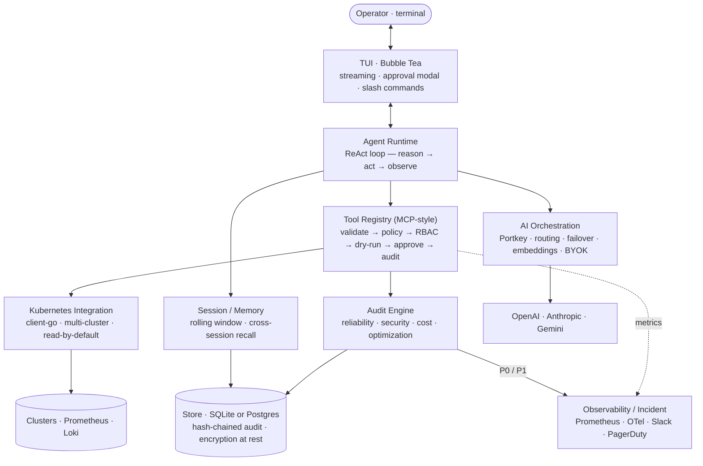
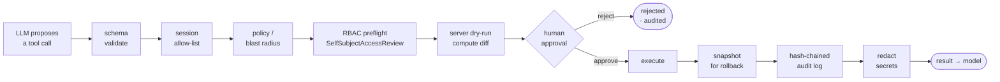

# voujr

> A terminal-native, Kubernetes copilot — like Claude Code, specialized for cluster operations, auditing, troubleshooting, optimization, and remediation.

`voujr` lets operators talk to their clusters in natural language. It understands
live cluster state, reasons about workload relationships, runs an audit engine across
reliability / security / cost / optimization, proposes step-by-step remediation, and —
only with explicit approval — executes changes against the cluster.

```text
$ voujr

> Why are pods in production restarting?

Analyzing cluster…
  ✓ Connected to production (context: prod-eks-us-east-1)
  ✓ Scanned 312 pods across 18 namespaces
  ✓ Found 12 restarting pods in deployment/api-gateway

Root cause
  api-gateway readiness probe fails during JVM warm-up (avg 47s) but the
  startupProbe budget is 30s, so the kubelet kills the container before it is ready.

Recommendation  (P1 · reliability)
  Raise startupProbe failureThreshold 6 → 18 (30s → 90s budget).

  ▸ kubectl -n prod patch deploy/api-gateway --type=json \
      -p '[{"op":"replace","path":"/spec/.../startupProbe/failureThreshold","value":18}]'

Apply this fix? [y/N/dry-run]
```

## Status

A complete, end-to-end implementation of the design in
[docs/ARCHITECTURE.md](docs/ARCHITECTURE.md) — agent runtime, multi-provider AI,
MCP-style tools, the audit engine, SQLite **and** Postgres persistence, multi-cluster
UX, observability + alerting, an in-cluster controller, and a full CI/release pipeline.

It is verified but not yet battle-tested against production clusters — treat it as a
strong foundation to harden, not a finished SaaS.

| Check | Result |
|-------|--------|
| `go build` / `go vet` / `gofmt` | clean |
| `go test ./...` | **56 tests/subtests pass** |
| `govulncheck ./...` | **0 vulnerabilities** affecting our code |
| Helm chart (`deploy/helm`) | lints clean, renders 7 manifests |
| GoReleaser config | validates; snapshot build produces a working binary |
| GitHub Actions workflows | `actionlint` clean |

## Quick start

```bash
make tidy        # resolve dependencies (needs Go 1.25+)
make build       # -> bin/voujr
export ANTHROPIC_API_KEY=...      # or OPENAI_API_KEY / GEMINI_API_KEY / PORTKEY_API_KEY
./bin/voujr --context prod-eks-us-east-1
```

By default the agent runs **read-only**. Any mutating action is gated behind an approval
prompt, runs a server-side dry-run, snapshots the prior state for rollback, and is
recorded in an immutable, hash-chained audit log.

## Commands

```bash
voujr [--context CTX] [--mode read-only|propose|apply]   # interactive copilot (TUI)
voujr --clusters stage,dr                                # register extra clusters (/cluster to switch)
voujr --resume <session-id>                              # resume a prior conversation
voujr sessions                                           # list recent sessions
voujr audit [-n NAMESPACE] [--json]                      # one-shot audit scan (no AI key needed)
voujr controller [--in-cluster] [--interval 15m]         # continuous audit (team mode)
```

In-session slash commands: `/cluster <name>`, `/clusters`, `/help`.

## Architecture at a glance



See [docs/ARCHITECTURE.md](docs/ARCHITECTURE.md) for the full design: agent runtime,
AI routing, MCP tool model, DB schema, security/RBAC model, multi-cluster strategy,
scalability, deployment, and trade-offs vs. Claude Code & kubectl.

## The mutation safety chain

Every mutating tool call passes the same gauntlet before it can touch a cluster — there
is no code path to execution that skips it.



Read-only by default; in `read-only` mode mutating tools aren't even advertised to the
model. The LLM only *chooses* the tool and arguments — deterministic Go validates, gates,
executes, and audits.

## Repository layout

| Path | What lives here |
|------|-----------------|
| `cmd/voujr` | CLI entrypoint, subcommands, dependency wiring |
| `internal/agent` | Agent runtime — the reason/act/observe loop, memory recall, usage accounting |
| `internal/ai` | Provider abstraction, Portkey gateway, model router, streaming, embeddings, failover |
| `internal/tools` | MCP-style tool registry + safety chain; kubectl/audit/prometheus/remember tools |
| `internal/k8s` | client-go integration, multi-cluster registry, snapshot/context card, RBAC preflight |
| `internal/audit` | Audit engine + rule library (reliability/security/cost/optimization) |
| `internal/controller` | In-cluster continuous-audit loop (team mode) |
| `internal/session` | Conversation window + long-term memory |
| `internal/store` | Persistence: SQLite (local) and Postgres (server) behind one interface |
| `internal/security` | Secret redaction, mutation policy, RBAC helpers, AES-GCM encryption at rest |
| `internal/tui` | Bubble Tea terminal UI |
| `internal/observability` | Prometheus metrics, structured logging |
| `internal/incident` | Slack / PagerDuty alerting |
| `internal/config` | Layered configuration (flags / env / file) |
| `migrations` | SQL schema migrations (SQLite + Postgres) |
| `deploy` | Dockerfiles, Helm chart, RBAC manifests |
| `.github/workflows` | CI (build/vet/test/govulncheck/lint) and tagged-release pipeline |

## Deploy the controller (team mode)

```bash
helm upgrade --install voujr deploy/helm \
  --namespace voujr --create-namespace \
  --set incident.slack.existingSecret=voujr-slack
```

This runs `voujr controller --in-cluster`: it scans the registered fleet on a schedule,
persists findings, fires Slack/PagerDuty alerts for P0/P1, and serves `/metrics`. It uses
a read-only ServiceAccount and needs no AI key. Point it at a Postgres DSN (`DATABASE_URL`)
for durable, shared findings across replicas.

## Safety model (TL;DR)

- **Read-only by default.** Mutations require an explicit approval gate.
- **Least privilege.** The agent's ServiceAccount/kubeconfig grants only what its enabled
  tools need; writes need a separate, opt-in role, preflighted with `SelfSubjectAccessReview`.
- **Dry-run first.** Mutating tools run a server-side dry-run and show a diff before apply.
- **Rollback.** Every applied change snapshots the prior object for one-command revert.
- **Tamper-evident audit.** Every tool call (args, diff, approver, result) is appended to a
  hash-chained audit log; sensitive columns are encrypted at rest (`VOUJR_DB_KEY`); secrets
  are redacted before they ever reach a model or a log.

## License

Licensed under the [Apache License 2.0](LICENSE).
